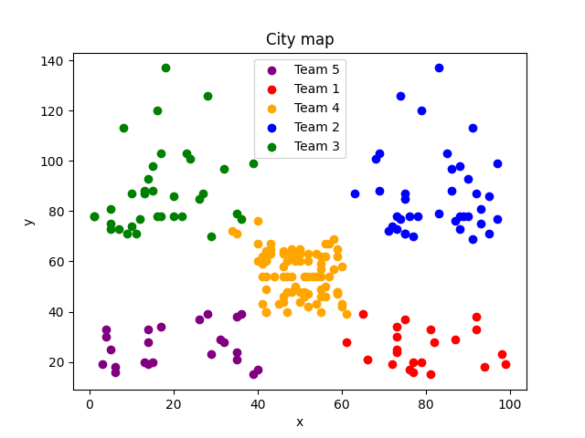

## KmeansAlgorithm

## Question

You have been hired as a data scientist at a green space design company. The company uses aerial images to identify areas with poor green space. In the dataset, the y-coordinates of the images are labeled as feature_1 and the x-coordinates as feature_2. The company plans to send out 5 teams. Your task is to assign a team to each point in a way that minimizes the travel costs between team members (e.g., it is not logical to assign points in the north and south of the city to the same team since they are far apart and not optimal). Add a new feature called "team_number" to the dataset and enter the desired team number. Submit the dataset with the added feature along with the requested items.

## Solution Idea

To solve this question, the k-means algorithm is used. We perform clustering based on the desired number of teams.

## Class: KmeansAlgorithm

This class contains four functions, three of which are defined as private (initialize_centroids, closest_centroid, move_centroids). It also includes the run function, which can be used to execute the operations.

- `__initialize_centroids`: This function initially considers all points as initial centroids and randomly shuffles them to select the desired initial centroids.

- `__closest_centroid`: This function calculates the distance between each data point and all centroids and determines the cluster that is closest to it.

- `__move_centroids`: This function calculates a new centroid for each cluster, which is the average of the data points in that cluster.

## Class: Plot

This class handles the plotting tasks. It has a function called create_plot, which prints the desired map by providing the dataset.

## Main Section

In this section, we execute the program. We first read the desired dataset and then pass it to the implemented k-means algorithm for clustering. In the final steps, we generate the final Excel file and plot the created clusters.

## How to Use

To run this program, you need to place the desired dataset next to the Python file and then execute the main.py file.

## Requirements

To run this code, you need to install the numpy, pandas, and matplotlib libraries. You can install these libraries using the following commands:

```
pip install numpy
pip install pandas
pip install matplotlib
```

You can also use the following command for convenience:

```
pip install -r requirements.txt
```

## Result
